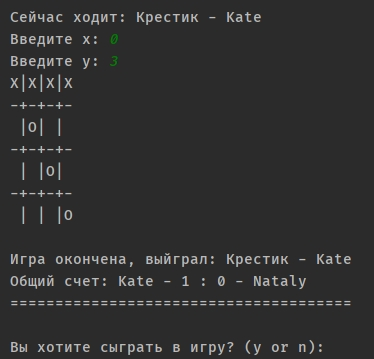

# Игра "Крестики-Нолики"

Данная программа реализует игру в Крестики-Нолики (TicTacToe). Игру ведут два игрока. Реализация ИИ не предусмотренна.

## Преимущества данной реализации

1. Игру можно вести на любом поле, от размера 3 на 3, до N на N.
2. После окончания серии игр, результаты записываются в файл **record.txt** в виде 
>Общий счет: name1 - win1 : win2 - name2
3. Проверка на выигрыш ведется автоматически.
4. Так же возможна ничья, при этом ни один из игроков не получают очки.
5. После выигрыша одного из игроков можно возобновить игру, при этом уже имена игроков вводить не надо, но меняется порядок игры. Тот кто играл крестиком теперь играет ноликом. Чередование происходит при каждом раунде игры.
6. Крестик всегда ходит первым.

## Процесс игры

1. Можно сразу отказаться от игры введя латинскую букву n.
2. Пока не будет введена верная размерность игрового поля (больше 3 включительно) играть будет невозможно.
3. Вводим имена игроков.
4. Для выхода на любом этапе игры достаточно ввести **-2** в любое поле для ввода координат.
5. Вводятся координаты от нуля до n-1 (т.е. для размера поля 3x3 это от 0 до 2).

  
6. Игра идет по очереди.

  
7. Невозможно ввести координату занятого поля.

  
8. Невозможно ввести координаты не существующего поля.

  
9. Невозможно ввести не цифру.

  
10. Все верно, ход переходит к следующему игроку.

  
11. Игра окончена, выиграл Крестик. Общее число побед первого игрока (Kate) увеличено на один.

  
12. Игроки продолжили игру. Имена у игроков не спрашиваются повторно.

  
13. На этот раз победу одержала Helga, и ее количество побед увеличено на 1.

  
14. Игроки сыграли в ничью. Общее соотношение побед не изменилось.

  
15. Игроки закончили игру, их результаты записаны в файл.

  
16. В файле появился результат текущей игровой сессии.

  
17. Можно играть на поле 4x4. Правила остались те же самые.

  
18. Игра на поле 4x4 окончена.

## Приятной игры!